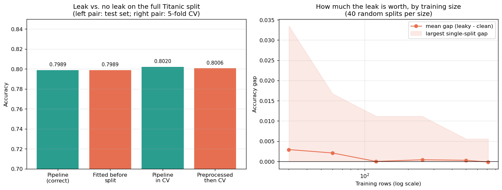

# ML Fundamentals – Pipeline, ColumnTransformer & What Leakage Actually Costs

# Session Summary: The Leak Was Worth +0.0000, And That Is The Finding

One script, one figure. This session set out to demonstrate the thing
`CLAUDE.md` puts first in its code-review guidance — *"data leakage (scaler or
encoder fitted before the train/test split)"* — by measuring what it costs.

**It costs nothing here.** On the Titanic split this repository shares across six
directories, fitting the entire preprocessor on all 891 rows before splitting
produced **exactly the same test accuracy** as doing it correctly: 0.7989 either
way. Leaking across cross-validation folds made the score *worse* by 0.0014.

That result is written up as it came out rather than quietly replaced with a
scarier dataset. The useful conclusion is not "leakage doesn't matter" — it is
that **preprocessing leakage and target leakage are two different problems that
get taught under one name**, and only one of them is worth the fear.

The genuinely dangerous finding came out of a crash, not a plan: the correct
pipeline **raises an error** where the leaky one silently returns a number.

## The gap this closes

Backlog task #7. `Pipeline` and `ColumnTransformer` were already used correctly
in eight files (`logistic_regression/`, `trees_and_boosting/`,
`shap_explainability/`, `knn_and_naive_bayes/`, `hyperparameter_search/`), so
another demo *using* them would have taught nothing new. `trees_and_boosting/`
already demonstrates **target** leakage via the `alive` column. What no file
here did was measure the **preprocessing** leak that `CLAUDE.md` actually names.

It is not hypothetical in this repository:

`linear_regression/CaliforniaHousingLinearRegression.py:43-45`
```python
scaler = StandardScaler()
X_scaled = scaler.fit_transform(X)                    # fitted on all 20,640 rows
X_train, X_test, y_train, y_test = train_test_split(X_scaled, y, ...)
```

## Running

```bash
cd feature_pipelines
pip install -r requirements.txt
python FeatureEngineeringPipeline.py
```

Writes `plots/leakage_cost.png`. Runs in well under a minute; the only slow part
is section 3's 480 model fits.

## What was measured

### 1. Preprocessor fitted before the split — **+0.0000**

| | Test accuracy |
|---|---|
| `Pipeline`, fitted on training rows only | **0.7989** |
| `ColumnTransformer` fitted on all 891 rows, then split | **0.7989** |

Identical. The leak is real — the median used to fill 177 missing `age` values
and the mean/σ used to scale `fare` were all computed partly from the 179 test
rows — and it changed nothing.

The reason is dilution. A leaked *statistic* is an average over train and test
together, so the test rows only shift it in proportion to their share of the
data. With 712 training rows they barely move it, and logistic regression is
scale-invariant in its decisions anyway once it has converged. This is the
mechanism that makes preprocessing leakage mild: it leaks an aggregate, not a
label.

Target leakage has no such dilution — one leaked column carries the answer for
every row individually. That is why `trees_and_boosting/` hit 1.0000 accuracy
with the `alive` column while this hit +0.0000 with a scaler. **Same word, two
unrelated magnitudes.**

### 2. Leaking across cross-validation folds — **−0.0014**

The subtler version, and the one more common in real code, because the
train/test split *was* respected. Preprocessing `X_train` once and then calling
`cross_val_score` on the resulting array means each validation fold helped
compute the statistics used to prepare it.

| | 5-fold CV accuracy |
|---|---|
| `Pipeline` passed to `cross_val_score` | **0.8020** ± 0.0142 |
| Pre-transformed array passed instead | **0.8006** ± 0.0149 |

Four of the five folds were bit-identical; one moved by −0.0070. The leak made
the estimate *worse*, which is a sign the difference is noise rather than
optimism. At this sample size the effect is below the fold-to-fold spread of
±0.014, so it is not measurable even in principle.

### 2b. The leak suppresses an error — **the finding that matters**

This section was not planned. It exists because section 3 crashed on its first
run, and the crash turned out to be more instructive than the numbers.

`embarked` has three levels, and `Q` is rare (77 of 891 rows). A small training
sample can miss it entirely. With a 30-row training set (seed 1):

```
training embarked levels: ['C', 'S']
test embarked levels    : ['C', 'Q', 'S']
correct Pipeline        : ValueError -- Found unknown categories ['Q'] during transform
leaked encoder          : 0.7430  (no error raised)
```

The correctly-fitted encoder **fails loudly**, and the failure is a true
statement about the data: *your training sample does not represent your test
set.* The encoder fitted on all rows before the split already knew about `Q`, so
it transformed the test set happily and reported a plausible accuracy.

The leak did not inflate the score. It **deleted the evidence that something was
wrong** — and then handed back a number with no warning attached. That is the
real cost, and it is invisible in any accuracy comparison, which is presumably
why sections 1 and 2 of this script found nothing.

### 3. When does the accuracy gap stop being zero?

Same leak as section 1, swept across training-set size, 40 random splits per
size because at n=30 a single split swings by more than the effect being
measured.

| n_train | clean | leaky | mean gap | largest single gap | splits that differed at all | splits missing a category |
|---|---|---|---|---|---|---|
| 30 | 0.7506 | 0.7535 | **+0.0029** | 0.0335 | 30 / 40 | 6 / 40 |
| 60 | 0.7746 | 0.7767 | +0.0021 | 0.0168 | 17 / 40 | 0 |
| 120 | 0.7906 | 0.7906 | −0.0000 | 0.0112 | 13 / 40 | 0 |
| 250 | 0.7992 | 0.7996 | +0.0004 | 0.0112 | 6 / 40 | 0 |
| 500 | 0.7983 | 0.7986 | +0.0003 | 0.0056 | 2 / 40 | 0 |
| 712 (full) | 0.8000 | 0.7999 | −0.0001 | 0.0056 | 1 / 40 | 0 |

Even at its worst — 30 training rows — the mean gap is **+0.0029**, roughly a
quarter of one test prediction. The largest *single* split reached 0.0335, but
the mean sits near zero, so that is spread rather than bias.

The column that actually moves is the last one. At n=30, 6 of 40 splits had a
test category the training set never saw — six chances for the leak to hide a
broken sample, which the accuracy columns are completely blind to.



The left panel is four nearly-equal bars. That is the honest picture, and
drawing it at a y-range that makes the difference look dramatic would have been
the dishonest alternative.

## What this changes about reviewing this repo

`CLAUDE.md` is right to put leakage first, but the reasoning in the backlog
("the #1 item") overstated the case slightly — the list in `CLAUDE.md` is not
declared as ranked, and leakage is simply its first example. The *defensible*
argument for the top slot turns out not to be effect size at all:

1. **It is silent.** No exception, no failing test. The number just looks fine.
2. **Nothing else catches it.** There is no pytest suite, and CI covers only
   `sagemaker-pipeline-demo/`. Review-by-reading is the only gate.
3. **The number is the deliverable.** These demos produce figures that get
   written into `README.MD` files as portfolio claims.
4. **Leaky code reads better.** `scaler.fit_transform(X)` followed by a split is
   tidier prose than threading a transformer through a split. Skimming for
   ugliness finds nothing.
5. **It conceals other bugs** — section 2b.

What this session does *not* support is reviewing on the premise that a stray
`fit_transform` has inflated a headline accuracy. On tabular data at this scale
it has not. The right reason to fix it is correctness and the errors it hides,
not a number that moved.

## The practical argument for the wrapper

Sections 1 and 2 found no accuracy reason to use `Pipeline`. The reason to use
it anyway is that it removes the *category* of mistake rather than its cost:

```python
pipe = Pipeline(steps=[("prep", make_preprocessor()), ("model", make_model())])
pipe.fit(X_train, y_train)      # fits the transformer on training rows only
pipe.score(X_test, y_test)      # calls transform(), never fit_transform()
```

There is no order to get wrong because there is no order to write. The same
object then drops into `cross_val_score` and `GridSearchCV` and is re-fitted
per fold automatically — which is what `hyperparameter_search/` relies on for
its 270 fits to mean anything.

## An sklearn detail worth recording

`OneHotEncoder` refuses `drop="first"` together with `handle_unknown="ignore"`.
Both produce an all-zero row — one for the dropped reference level, one for an
unknown category — so the two would be indistinguishable. Section 3 needs to
tolerate unknown categories in order to score them rather than crash, so it
keeps every level; sections 1, 2 and 2b use the strict build, which is what made
2b's error possible in the first place.

## Environment

Written against **scikit-learn 0.24.1** (`OneHotEncoder.get_feature_names`, no
`DecisionBoundaryDisplay`), pandas 2.0.3, seaborn 0.11.1 — the versions in the
`ml4t` environment the rest of this repository is run from.
