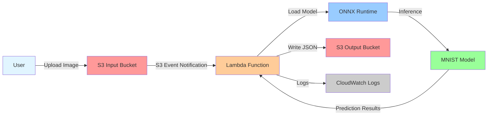
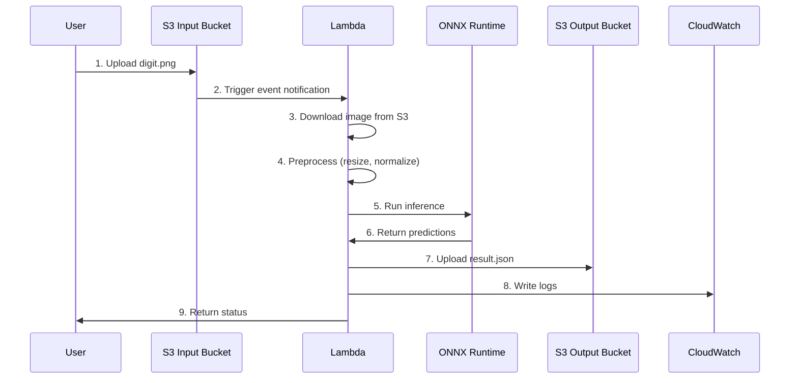

# Serverless AI Inference Architecture

## Overview
Event-driven AI inference system using AWS serverless components.

## Architecture Diagram



## Data Flow



## Component Details

### S3 Input Bucket
- **Purpose**: Receives uploaded images for inference
- **Trigger**: S3 Event Notification on `.png` file creation
- **Access**: Private, no public access

### Lambda Function
- **Runtime**: Python 3.11
- **Memory**: 512 MB
- **Timeout**: 60 seconds
- **Handler**: `lambda_handler.lambda_handler`
- **Layers**: ONNX Runtime + MNIST model

### ONNX Runtime
- **Model**: MNIST digit classifier (mnist-12.onnx)
- **Input**: Grayscale image [1, 1, 28, 28]
- **Output**: Digit probabilities [10]
- **Inference Time**: ~10-50ms

### S3 Output Bucket
- **Purpose**: Stores inference results as JSON
- **Format**: `{predicted_digit, confidence, probabilities, metadata}`
- **Access**: Private, Lambda write-only

### CloudWatch Logs
- **Retention**: 7 days
- **Log Groups**: `/aws/lambda/mnist-serverless-inference`
- **Contents**: Request IDs, inference times, errors

## Event Structure

### S3 Event (Input)
```json
{
  "Records": [{
    "s3": {
      "bucket": {"name": "mnist-inference-input"},
      "object": {"key": "uploads/digit_5.png"}
    }
  }]
}
```

### Lambda Response (Output)
```json
{
  "statusCode": 200,
  "body": {
    "predicted_digit": 5,
    "confidence": 0.98,
    "probabilities": [0.01, 0.01, ...],
    "inference_time_ms": 23.45,
    "timestamp": "2024-01-01 12:00:00"
  }
}
```

## Cold Start Optimization

1. **Model in Lambda Layer**: Pre-package ONNX model in layer (separate from code)
2. **Global Session**: Reuse `OrtSession` across invocations
3. **Lazy Loading**: Model loaded only on first invocation
4. **Memory Allocation**: 512 MB reduces cold start time

## Security

- ✅ **S3 Private**: Block all public access
- ✅ **IAM Least Privilege**: Lambda can only read input, write output
- ✅ **VPC Optional**: Can deploy in VPC for additional isolation
- ✅ **Encryption**: S3 server-side encryption enabled by default
- ✅ **Logs**: CloudWatch for audit trail

## Cost Estimation (AWS)

**Assumptions**: 1000 images/month, avg 30ms inference

- **Lambda**: ~$0.20/month (512MB, 30ms × 1000 invocations)
- **S3**: ~$0.05/month (storage + requests)
- **CloudWatch**: ~$0.10/month (logs)
- **Total**: ~$0.35/month

## Local Development

Use **LocalStack** for free local AWS simulation:
```bash
docker-compose up localstack
```

This creates local S3 buckets at `http://localhost:4566`
